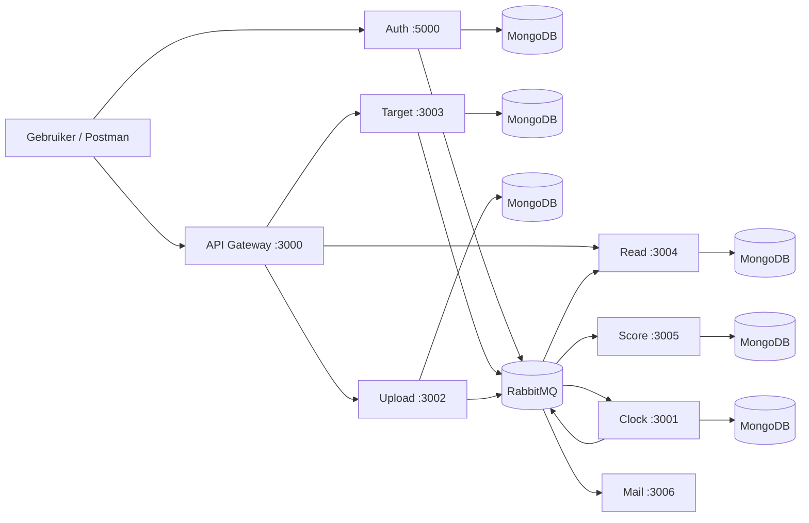

# Architectuur

## Overzicht

Dit project gebruikt een microservices-architectuur.
Niet alles loopt direct via een databasecall tussen services; een deel van de communicatie loopt via `RabbitMQ`.

## Hoofdonderdelen

- `API Gateway`
- `auth`
- `target`
- `upload`
- `read`
- `score`
- `clock`
- `mail`

## Architectuur in woorden

- De gebruiker praat vooral met de `API Gateway`
- De gateway zet requests door naar achterliggende services
- `auth` regelt registratie en login
- `target` slaat targets op
- `upload` slaat uploads op
- `read` bevat een leesmodel voor targets
- `score` berekent scores op basis van target + upload
- `clock` bewaakt deadlines
- `mail` verstuurt automatisch registratiemails

## Datastroom

## Waarom dit interessant is voor DevOps

Dit project past goed bij een DevOps-opdracht omdat je meerdere onderdelen tegelijk moet beheren:

- meerdere services
- meerdere poorten
- messaging
- databaseverbindingen
- secrets via `.env`
- monitoring/debugging over meerdere processen

## Pluspunten van deze opzet

- services zijn logisch gescheiden
- event-driven onderdelen zijn aanwezig
- gateway geeft een centraal binnenkomstpunt
- het project laat goed zien hoe data tussen services beweegt

## Nadelen of risico's

- veel losse processen handmatig starten
- afhankelijk van meerdere externe systemen
- geen containerisatie aanwezig
- geen CI/CD-configuratie aanwezig
- logging en health checks zijn nog beperkt

## Goede DevOps-vervolgstappen

- `Dockerfile` per service
- `docker-compose.yml` voor lokaal starten
- health endpoints voor alle services
- centrale logging
- CI pipeline voor install, lint en rooktest
- secrets beter beheren
