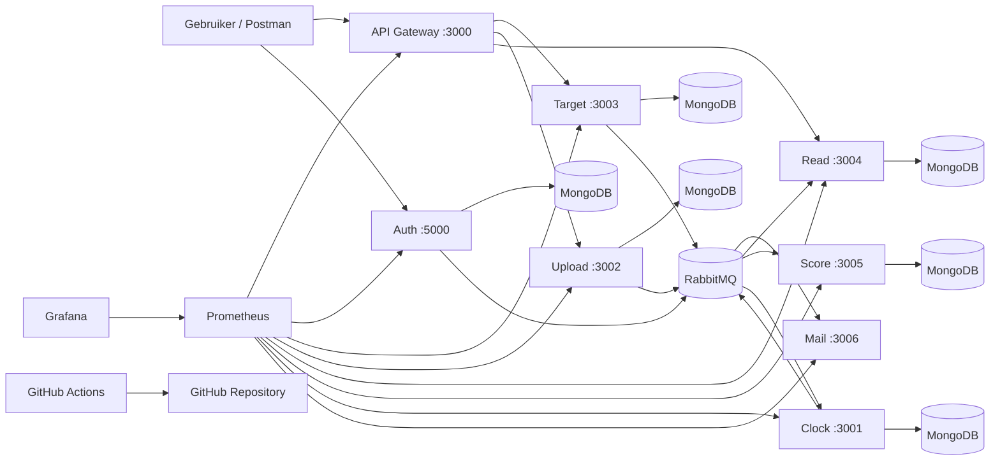

# Architectuur

## Overzicht

Dit project gebruikt een microservices-architectuur.
Requests lopen vooral via de `API Gateway`, terwijl events via `RabbitMQ` tussen services worden verspreid.

## Applicatielaag

- `API Gateway`
- `auth`
- `target`
- `upload`
- `read`
- `score`
- `clock`
- `mail`

## Ondersteunende laag

- `MongoDB` voor opslag
- `RabbitMQ` voor event-driven communicatie
- `Docker` voor containerisatie
- `Docker Swarm` voor orchestration
- `Prometheus` voor metrics
- `Grafana` voor dashboards
- `GitHub Actions` voor CI

## Architectuur in woorden

- De gebruiker praat met de `API Gateway`
- `auth` regelt registratie en login
- `target` en `upload` verwerken kernacties
- `read` bouwt een leesmodel op vanuit events
- `score` berekent scores op basis van target + upload
- `clock` bewaakt deadlines
- `mail` verstuurt automatische berichten
- `Prometheus` leest metrics uit
- `Grafana` toont die metrics in dashboards
- `GitHub Actions` controleert de code bij elke push of pull request

## Datastroom

## Waarom dit goed past bij DevOps

Dit project is sterk voor een DevOps-opdracht omdat je meerdere concerns tegelijk hebt:

- meerdere services en poorten
- database- en message-broker afhankelijkheden
- secrets en configuratie per service
- containerisatie en deploymentmogelijkheden
- codekwaliteit via linting
- monitoring en dashboards
- CI via `GitHub Actions`

## Logische vervolgstappen

1. `Dockerfile` per service toevoegen
2. `docker-compose.yml` maken voor lokaal gebruik
3. stack geschikt maken voor `Docker Swarm`
4. `ESLint` toevoegen aan elke Node-service
5. metrics endpoints toevoegen voor `Prometheus`
6. dashboards bouwen in `Grafana`
7. `GitHub Actions` pipeline maken voor install, lint en rooktest
